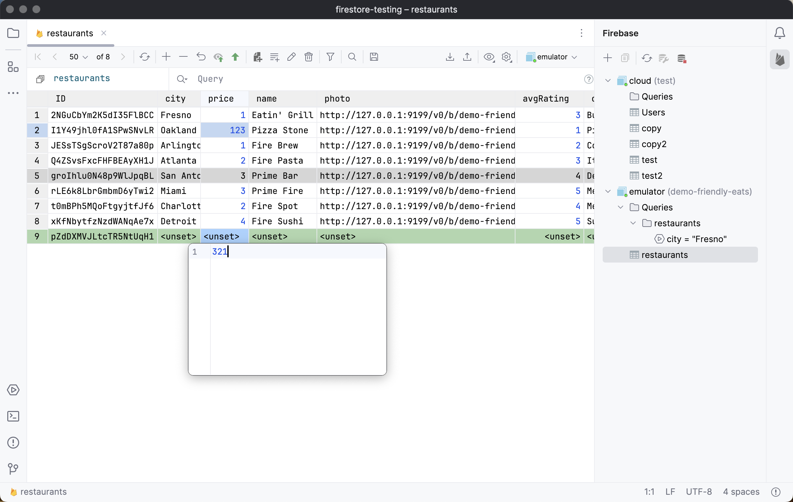
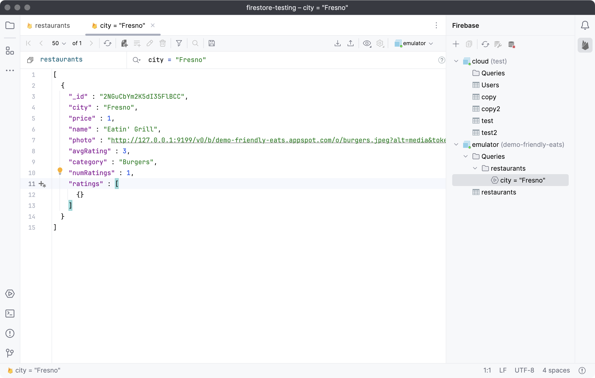

# Firestore Plugin for JetBrains IDEs

**Firestore Plugin** effortlessly integrates with Firebase Firestore, providing a straightforward and efficient interface for managing Firestore data and queries.
## Features
- **Connect to Firebase Firestore** with ease, supporting both cloud and emulator instances.
- **Browse and Manage Collections and Documents** in Table or JSON views.
- **Query Firestore** using a Simple Query Language with advanced autocomplete features.
- **Firestore Operations:** Add, update, and delete documents directly within the IDE.
- **Save Queries:** Store frequently used queries in Favorites.
- **Export and Import Data:** Support for formats like CSV and JSON.
- And much more!

[Explore more on the JetBrains Marketplace](https://plugins.jetbrains.com/plugin/23609-firebase-firestore)

